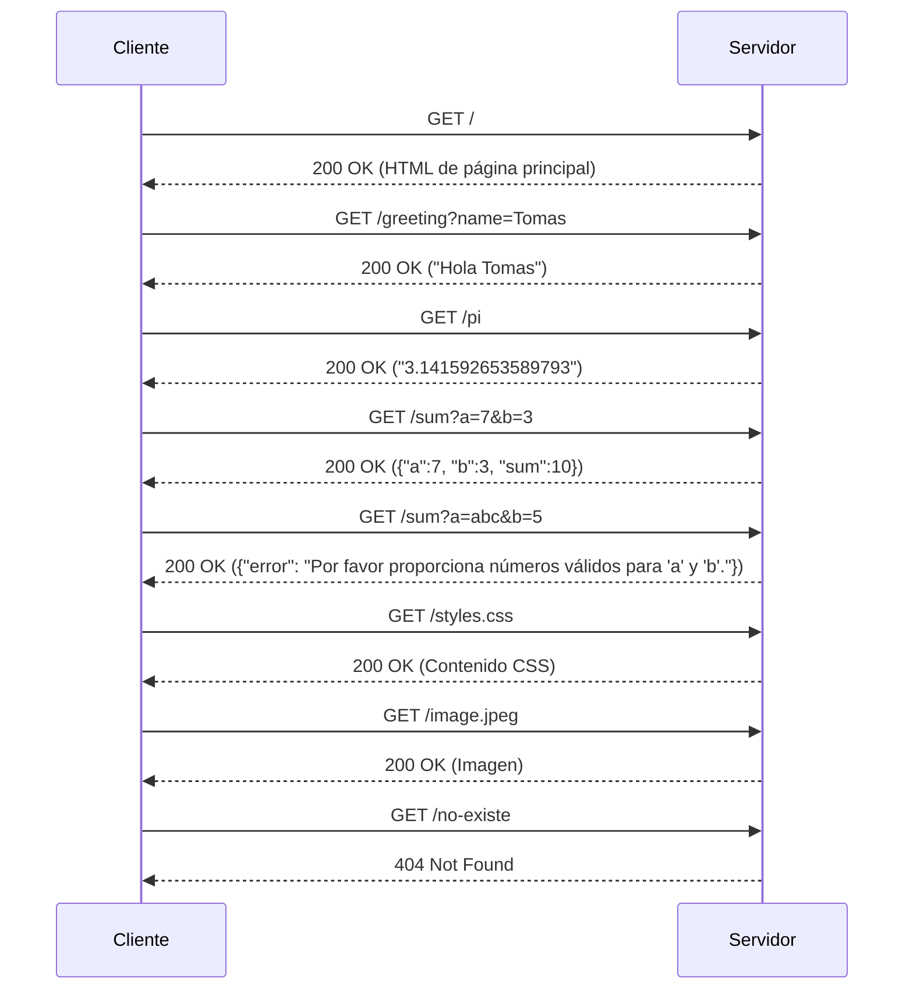
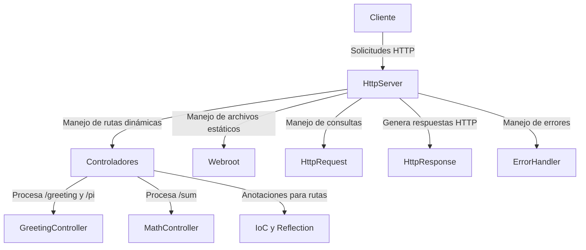

# Arquitecturas de Servidores de Aplicaciones, Meta protocolos de objetos, Patrón IoC, Reflexión
Tomas Suarez Piratova

Este proyecto implementa un **servidor web en Java** que permite entregar páginas HTML, imágenes PNG y manejar rutas dinámicas mediante un **framework IoC** construido desde cero. Se pueden definir controladores anotados con `@RestController` y métodos expuestos con `@GetMapping` para manejar solicitudes HTTP.

## 📌 Características

✅ Servidor web ligero basado en **sockets**  
✅ Soporte para **archivos estáticos** (`.html`, `.css`, `.js`, `.png`, `.jpeg`)  
✅ **Inversión de Control (IoC)**: carga automática de controladores con reflexión  
✅ Soporte para **rutas dinámicas** usando `@GetMapping`  
✅ Soporte para **parámetros en URL** con `@RequestParam`  
✅ **Pruebas unitarias con JUnit y Mockito**  

## Instalación

1.  **Clonar el repositorio:**
     
    `https://github.com/tomassuarez49/AREP-LAB03` 
    
2.  **Compilar el proyecto con Maven:** :
 
    
    `mvn clean install`
3. **Ejecución del proyecto** :
    

    `java -cp target/classes com.mycompany.lab03.HttpServer com.mycompany.lab03.controller.GreetingController com.mycompany.lab03.controller.MathController`

    
4.  **Estructura de archivos:**


   


    
    

## Ejecución

1.  **Iniciar el servidor:** Ejecutar la siguiente clase de la aplicacion para iniciar la aplicación:
        
    `HttpServer.java"` 
    
2.  **Accede al servidor:** Abrir tu navegador web y visitar `http://localhost:32000`. Aquí podrás:
    
    Accede al servidor: Abre tu navegador web y visita http://localhost:32000 Podremos:

   - [http://localhost:32000/index.html](http://localhost:32000/index.html) → Página principal  
   - [http://localhost:32000/hello?name=Pedro](http://localhost:32000/hello?name=Pedro) → Respuesta `"Hello Pedro"`  
   - [http://localhost:32000/pi](http://localhost:32000/pi) → Devuelve `"3.141592653589793"`    
   - [http://localhost:32000/styles.css](http://localhost:32000/styles.css) → Código css
   - [http://localhost:32000/image.jpeg](http://localhost:32000/image.jpeg) → Imagen 
   - [http://localhost:32000/sum?a=10&b=20](http://localhost:32000/sum?a=10&b=20) → Devuelve `{"a": 10, "b": 20, "sum": 30}`  


- **Gestión de rutas no encontradas**: 
  Devuelve un error 404 para rutas no válidas.

## Personalización

- Puedes agregar tus propios archivos HTML, CSS o imágenes en la carpeta `webroot` para que sean servidos por el servidor.
- Si deseas añadir nuevas rutas o funcionalidades, modifica la clase `HttpServer.java`.
- Si deseas añadir nuevos controladores o funcionalidades, se deben crear en el paquete `controller` y anotarlos debidamente.

## Pruebas

El proyecto incluye un conjunto de pruebas automatizadas para garantizar el correcto funcionamiento del servidor:

1. **Ejecuta los tests con Maven**:
    ```bash
    mvn test
    ```

2. ### 🔍 **Resumen de las pruebas implementadas**

## 📌 Pruebas del Servidor

| **Test**                  | **Descripción**                                | **Entrada de Ejemplo**      | **Salida Esperada** |
|---------------------------|----------------------------------------------|----------------------------|----------------------|
| **Ruta `/greeting`**       | Devuelve un saludo con el nombre recibido.  | `/greeting?name=Pedro`     | `"Hola Pedro"`      |
| **Ruta `/pi`**             | Devuelve el valor correcto de π.            | `/pi`                      | `"3.141592653589793"` |
| **Ruta `/sum`**            | Suma dos números y devuelve JSON.           | `/sum?a=10&b=20`           | `{"a":10, "b":20, "sum":30}` |
| **Manejo de error en `/sum`** | Maneja parámetros inválidos.              | `/sum?a=x&b=10`            | `{"error": "Por favor proporciona números válidos para 'a' y 'b'."}` |
| **Archivos estáticos**     | Verifica que se puedan leer archivos en `webroot/`. | `/index.html` | `Contenido de index.html` |
| **Manejo de error 404**    | Verifica que el servidor responde correctamente a rutas inexistentes. | `/no-existe` | `<h1>Archivo no encontrado</h1>` |


---


3, **Pruebas en el navegador**


## Diagrama de Arquitectura

### Secuencia


## Componentes


